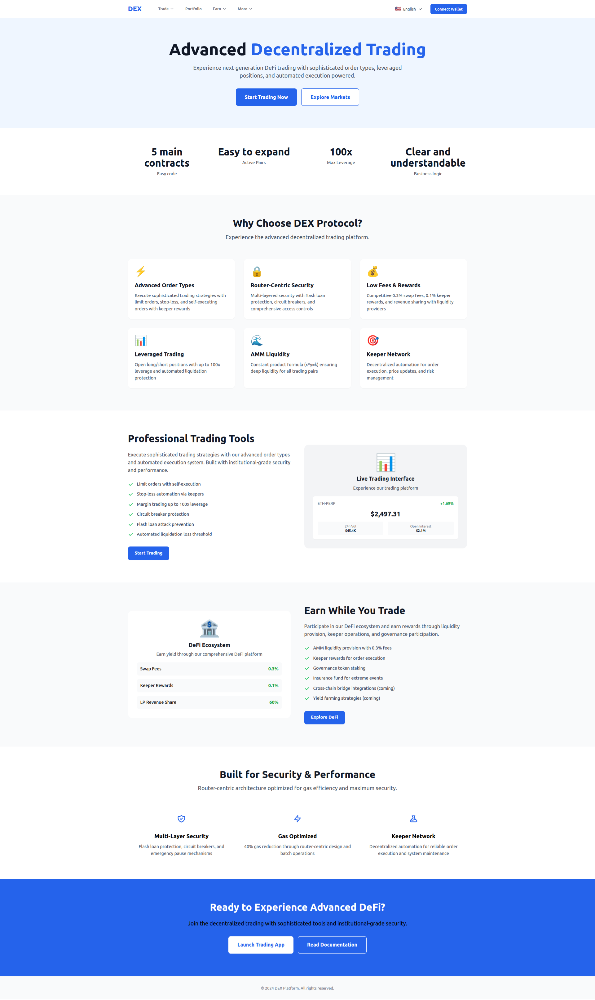
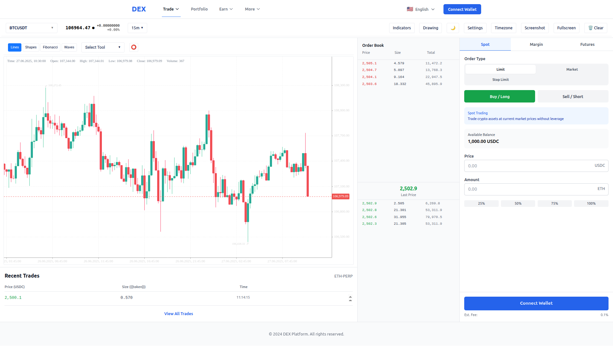
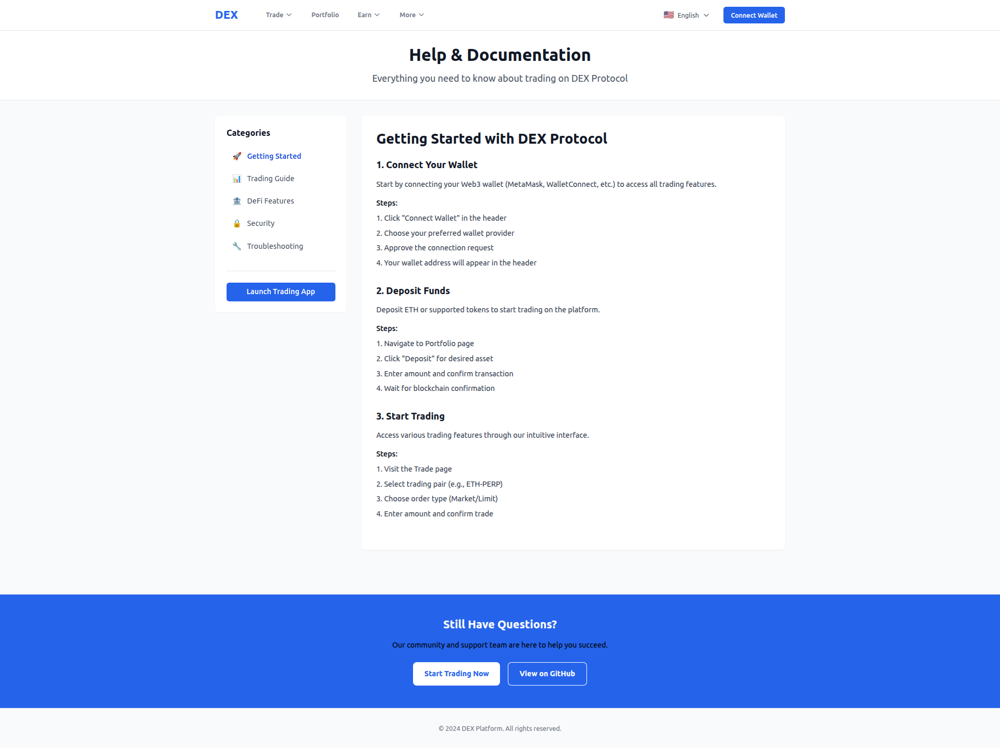

# DEX Frontend - SvelteKit Application

Frontend application for decentralized exchange based on SvelteKit with full routing and UI components.


## Advanced Decentralized Trading Landing pages 




## Trades pages




## Help & Documentation pages




## Installation and Launch

### 1. Creating Project Structure

Execute Python script to create all necessary files:


### Installing Dependencies

```bash
npm install
```

### Running in Development Mode

```bash
npm run dev
```

Application will be available at `http://localhost:5173`

### 4. Building for Production

```bash
npm run build
npm run preview
```

## Project Structure

```
src/
├── routes/                    # SvelteKit file routing
│   ├── +layout.svelte        # Main layout
│   ├── +page.svelte          # Main page (redirect)
│   ├── trade/                # Trading pages
│   │   ├── +page.svelte      # Redirect to ETH-PERP
│   │   └── [pair]/+page.svelte # Trading page
│   ├── markets/+page.svelte  # Markets list
│   ├── portfolio/+page.svelte # Portfolio with tabs
│   ├── swap/+page.svelte     # Token swap
│   ├── earn/+page.svelte     # Earning
│   ├── rewards/+page.svelte  # Rewards
│   ├── settings/+page.svelte # Settings
│   └── help/+page.svelte     # Help
├── lib/
│   ├── components/           # Reusable components
│   │   ├── common/          # Common components
│   │   ├── trading/         # Trading components
│   │   ├── portfolio/       # Portfolio components
│   │   └── ui/              # Basic UI components
│   ├── stores/              # Application state
│   ├── utils/               # Utilities and business logic
│   └── styles/              # Global styles
└── app.html                 # HTML template
```

## Functionality


#### Routing and Navigation
- Full SvelteKit file routing
- Navigation menu with dropdowns
- Mobile version with hamburger menu
- Active navigation states
- Automatic redirects

#### Pages
- **Trading** (`/trade/`)
  - Price chart
  - Order book
  - Order creation form
  - Recent trades
  
- **Markets** (`/markets`)
  - Trading pairs list
  - Filtering and search
  - Sorting by parameters

- **Portfolio** (`/portfolio`)
  - Tabs: Positions, Orders, Balances, History
  - General portfolio statistics
  - Deposit/withdrawal buttons

- **Swap** (`/swap`)
  - Token swap form
  - Token selection from dropdown
  - Fee and slippage calculation

- **Other Pages**
  - Earn, Settings, Help

#### Components
- Wallet connection
- Basic UI components (Button, Input, Modal, Table, Tabs)
- Trading components
- Portfolio components

#### State
- Wallet store for wallet management
- Trading store for trading operations
- Portfolio store for portfolio data


## Technologies

- **SvelteKit** - framework
- **Tailwind CSS** - styling
- **Ethers.js** - blockchain interaction
- **Web3** - additional Web3 support
- **Axios** - HTTP client
- **PostCSS** - CSS processing


## Licensing

Linkora DEX Backend uses dual licensing model

- **Open Source**: GNU Affero General Public License v3.0 (AGPL v3)
- **Commercial**: Proprietary license for commercial use

Details see in [LICENSING.md](./LICENSING.md)

### Quick License Selection

**Use AGPL v3 if**
- Your project is also open source
- Ready to share all changes
- Comply with copyleft requirements

**Need Commercial License if**
- Developing proprietary software
- Providing closed SaaS services
- Enterprise support required

**Contact**: licensing@linkora.info
